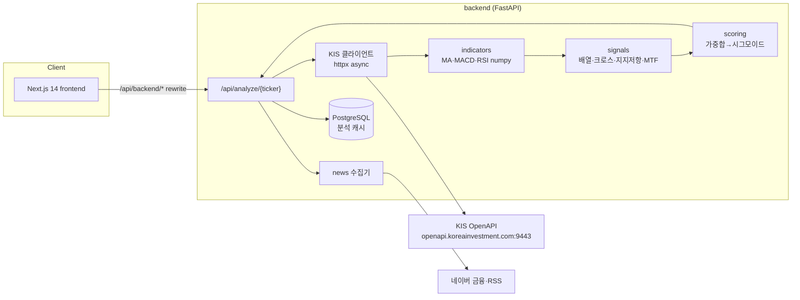

# 아키텍처

국내 주식 이동평균선 기반 실시간 분석 웹앱.
매수/매도 추천 없이 **상방/하방 확률과 근거**만 리포트한다.

## 시스템 구성

## 데이터 흐름 (analyze 요청 1건)

1. `GET /api/analyze/{ticker}` 수신.
2. **캐시 확인** — 장중 5분 / 장외 60분 TTL. 히트 시 즉시 반환 (<500ms).
3. 미스 시 KIS API 병렬 호출 (asyncio + httpx):
   - 현재가 (`FHKST01010100`)
   - 일봉 ~300개 (`FHKST03010100`, 100개/호출 페이징)
   - (Phase 1 후반) 60분봉 → 240분봉은 pandas resample (09:00 개장 앵커)
4. **indicators** — numpy 벡터연산으로 MA(5/10/20/60/120/200), MACD(12,26,9), RSI(14).
5. **signals** — 배열 판정, 골든/데드크로스(5-20, 20-60, 60-120), 지지/저항, 이격도(±5/10%), 거래량, MTF 정합성. 각 신호는 **순수 함수** (입력: 시계열 배열 → 출력: Signal 목록 + 스코어).
6. **scoring** — 신호별 스코어(-1~+1) × `config/weights.yaml` 가중치 → 합산 → 시그모이드 → 상방 확률(%). 신호별 기여도 breakdown 포함.
7. 뉴스(최근 7일·10건)·매크로 문장(`config/sectors.yaml`) 병합 → 응답 조립 → DB 캐시 저장 → 반환 (<10초).

## 응답 스키마

`frontend/src/lib/types.ts`의 `AnalyzeResponse`가 **단일 소스 오브 트루스**.
백엔드 Pydantic 모델은 이 타입과 1:1로 유지한다 (camelCase alias 사용).

## 모듈 책임 (backend/src/)

| 모듈 | 책임 | 순수성 |
|---|---|---|
| `api/` | FastAPI 라우터, 요청 검증, 캐시 판단 | I/O |
| `data/kis_client.py` | 토큰 캐시(24h), 시세 조회, rate limit, 재시도 | I/O |
| `data/news.py` | 네이버 금융·RSS 수집 (Phase 1 후반) | I/O |
| `indicators/` | MA·MACD·RSI 계산 | **순수 함수** |
| `signals/` | 배열·크로스·지지저항·MTF 판정 | **순수 함수** |
| `scoring/` | 가중합·시그모이드·breakdown | **순수 함수** |
| `macro/` | sectors.yaml 매핑 → 근거 문장 | 순수 함수 |
| `db/` | SQLAlchemy 모델, 캐시 저장/조회 | I/O |

순수 함수 레이어(indicators/signals/scoring)는 pytest 커버리지 80% 목표.

## 결정 로그 (ADR-lite)

### ADR-1: KIS_ENV=real 유지, 주문 API 코드 차단
실전/모의투자 앱키는 **별도 발급**이며 서버 주소도 다르다
(실전 `openapi.koreainvestment.com:9443`, 모의 `openapivts.koreainvestment.com:29443`).
보유 앱키는 실전용이므로 paper 전환 시 인증 불가. Phase 1은 시세 조회(읽기 전용)만
사용하므로 real 유지가 안전하다. 안전장치:
- KIS 클라이언트에 **조회 TR ID 화이트리스트** — 그 외 TR은 예외 발생.
- 주문·정정·취소 관련 코드는 리포지토리에 작성 금지.

### ADR-2: 공식 라이브러리 대신 httpx 직접 호출
`koreainvestment/open-trading-api`는 requests 기반 sync 예제 모음.
asyncio 병렬화 요건(현재가+일봉+분봉 동시 조회)과 맞지 않아
필요한 4개 내외 엔드포인트만 얇은 async 클라이언트로 직접 구현한다.

### ADR-3: 240분봉은 09:00 개장 앵커 리샘플
KIS는 240분봉 미제공 → 60분봉을 pandas resample.
국내 장 09:00~15:30 기준 09:00-13:00 / 13:00-15:30(부분봉) 2개 봉.
자연시간(00/04/08…) 앵커가 아닌 개장 앵커 — 국내 HTS 관례와 일치.

### ADR-4: 뉴스 감정 태그는 Phase 1에서 NEUTRAL 고정
Claude API 미보유. Phase 1 응답의 `news[].tag`는 전부 `NEUTRAL`,
`summary`는 생략(제목·URL·날짜·출처만). Phase 3에서 claude-haiku-4-5로 교체.

### ADR-5: 캐시 TTL은 장 상태 인지형
- 장중(평일 09:00~15:30 KST): **5분**
- 장외·주말: **60분**
장 상태 판정은 KST 기준 단순 시각 비교(공휴일 미반영 — Phase 2에서 개선 검토).

## 보안 규칙

- `.env` 커밋 금지 (.gitignore), 시크릿 하드코딩 금지.
- 프론트는 KIS 키에 접근 불가 — 반드시 백엔드 경유 (`/api/backend/*` rewrite).
- KIS rate limit 초당 20건 준수 — 클라이언트 레벨 세마포어 + 429 지수백오프.
- 토큰은 `backend/.cache/`에 로컬 캐시 (gitignore 대상).

## 배포 (Phase 2)

- 백엔드: Render (free) · DB: Neon Postgres · 프론트: Vercel
- UptimeRobot 5분 핑으로 Render sleep 방지

### ADR-6: 신호 우선순위 재설계 (2026-07-23)
거래량 > 수평 지지·저항(매물대) > 추세선·채널 > 이동평균 > 캔들패턴 > 보조지표
순으로 가중치 재배열. 거래량 미동반 돌파는 fake breakout으로 감점, 캔들패턴은
지지/저항 부근 출현 시에만 유효(허공 0.2배), 서로 다른 계열 3개 이상 동방향이면
multi_confirm 가산. 구현: signals/advanced.py, 가중치: config/weights.yaml.
